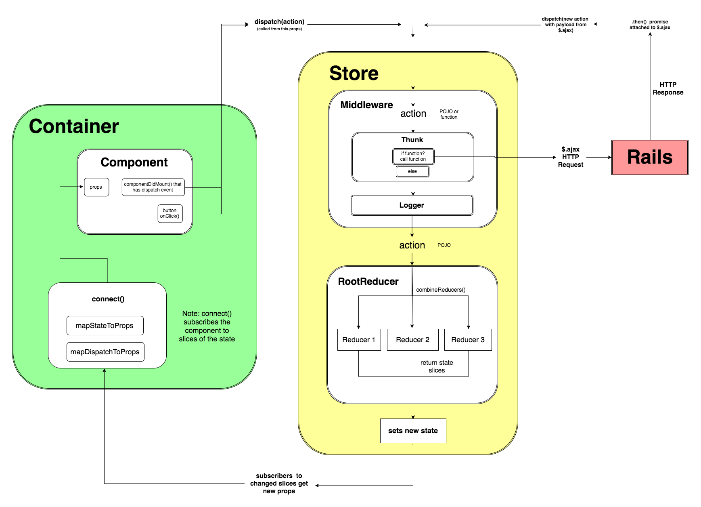

# Thunk Middleware

---


Note:

"You may be saying this to yourself right now."

---

### Learning Goals

  + `import` and `export` review
  + Redux cycle review
  + API Utility files
  + Middleware and Thunk
---

## Importing and Exporting

+ Named exports:
	+ Used to export several values
  + Must use the same variable names when importing in another a file.
```js
  // my_module.js
  export const myFunction = function() {...}

  export const foo = Math.sqrt(2);

  // In another file
  import { myFunction, foo } from 'my_module.js'
```

---
## Importing and Exporting
+ Default exports:
	+ There can be only one default export
  + Can be imported with any name
```js
// my_module.js
export default function someName() {...}

// In another file
import someTotallyDifferentName from 'my_module.js';
```
---

## Redux Cycle Review
* A predictable state container for JavaScript apps
* Implements a strict unidirectional data flow.
	* All data in an application follows the same lifecycle pattern.
	* Makes the logic of your app more predictable and easier to understand.
* Also encourages data normalization
	* you don't end up with multiple, independent copies of the same data that are unaware of one another.

---

## Redux Cycle Review

1. Create an action with an action creator
	+ An action is a POJO. For example:
	```js
	{ type: 'ADD_TODO', text: 'Read the Redux docs.' }
	```
2. Dispatch the action to the Redux store
3. The Redux store calls the reducer function you gave it.
	+ The store passes 2 arguments to the reducer: the current state and the action.
	+ You can use a root reducer to combine multiple reducers
4. The Redux store saves the new state returned by the reducer.
5. Connected React views update

---
# Full-Stack Diagram
---

## API Utils

+ connect backend & frontend via AJAX calls
```js
export const fetchTodos = () => (
  $.ajax({
    method: 'GET',
    url: '/api/todos'
  })
);
```

---

## Middleware

+ Redux provides a third-party extension point between dispatching an action, and the moment it reaches the reducer.
+ Common uses: Logging and sending async requests to an API.

---

```js
// store.js
import { createStore, applyMiddleware } from 'redux';
import logger from 'redux-logger';
import ReduxThunk from 'redux-thunk'

import RootReducer from '../reducers/root_reducer';

const configureStore = (preloadedState = {}) => {
  return createStore(
    RootReducer,
    preloadedState,
    applyMiddleware(ReduxThunk, logger)
  );
}
```

---

### Thunks

+ A function that wraps an expression to delay its evaluation.
```js
// calculation of 1 + 2 is immediate
// x === 3
let x = 1 + 2;

// calculation of 1 + 2 is delayed
// foo can be called later to perform the calculation
// foo is a thunk!
let foo = () => 1 + 2;
```
+ Used to delay an operation until it is needed, or to insert operations at the beginning or end of another subroutine.
---
## Redux Thunk middleware
* Comes in a seperate package called `redux-thunk`
* Allows you to write action creators that return a function instead of an action. (called _thunk action creators_, or just _thunks_)
* A thunk is used to delay the dispatch of an action
* When an action creator returns a function, that function will get executed by the Redux Thunk middleware, NOT by redux itself (i.e. your reducers).
* The inner (wrapped) function receives the store's `dispatch` method
* Use the `applyMiddleware()` store enhancer from Redux to include the Redux Thunk middleware in the dispatch mechanism
---

* Regular action:
```js
export const receiveTodos = todos => ({
  type: RECEIVE_TODOS,
  todos
});
```

* Thunk action:
```js
export const fetchTodos = () => dispatch => (
  TodoAPIUtil.fetchTodos()
  .then(todos => dispatch(receiveTodos(todos)))
);
```
---
### Function Definition
```js
const createThunkMiddleware = store => next => action => {
  if (typeof action === 'function') {
    return action(dispatch);
  }

  return next(action);
};
```
---
* Function Signature
```js
const createThunkMiddleware = store => next => action => {
  ...
};
```

* Under the hood
```js
createThunkMiddleware(store)(next)(action)
```

---

### Quiz

[Solutions](https://github.com/appacademy/daily-quiz/blob/master/react/w7d2.md)

---

### React/Redux Only


---

### React/Redux with Rails

